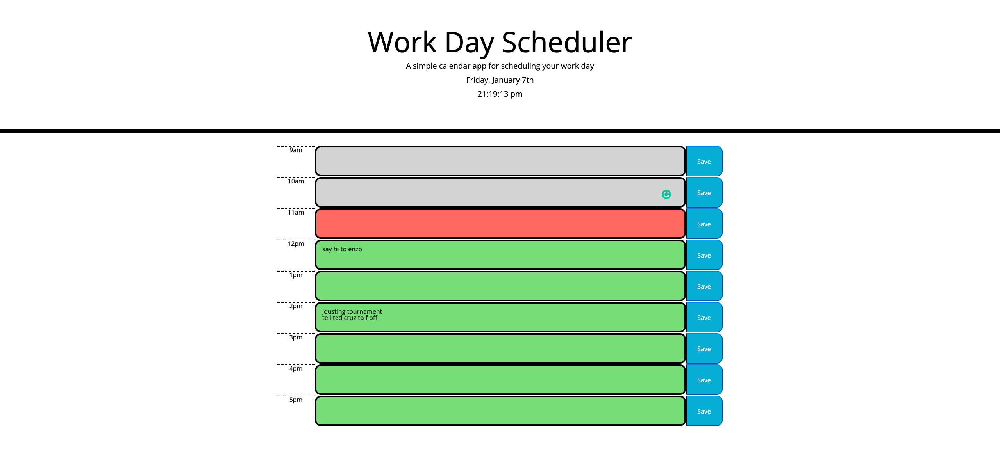

# day-planner

## description

This application allows a user to plan out their day. The user can add events to any hour block of the 9-5 workday and the events will be saved in local storage so the user can always leave the page and return without losing their agenda. The scheduler also displays past hour blocks in gray, future blocks in green, and the current block in red in order to quickly draw the user's attention to the tasks at hand.

This project was my first using bootstrap I enjoy the ease and freedom of splicing together code snippets. The table elements in bootstrap did leave a little to be desired but overall still served their purpose. I still struggle mightily with aligning content within divs... is it justify-content, justify-items, align-content, align-items, or display/flex??? Always seems to be the one I don't choose.

## screenshot

## live link

https://hcweigand10.github.io/day-planner/